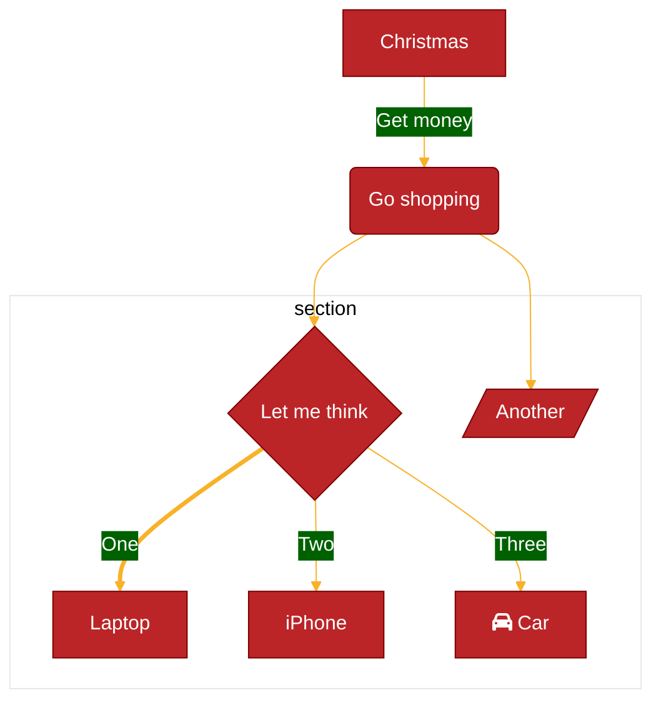

# Mark Sharp User Guide

> _Some features mentioned in this guide are only available with a Mark Sharp premium license._

## Installation

See [Quick Start](./README.md#Quick_Start).

## Basics

### Opening a Markdown file with Mark Sharp

There are several ways to launch the Mark Sharp editor:

1. In the [Explorer](https://code.visualstudio.com/docs/getstarted/userinterface#_explorer) view, **right click** on a Markdown file ( with a `.md` or `.markdown` file extension) > `Open With...` > `Mark Sharp`.
2. When a markdown file is open in VS Code's default editor, run the command `Mark Sharp: Switch Editor Mode` from the [command palette](https://code.visualstudio.com/docs/getstarted/userinterface#_command-palette).

### Slash Commands

Trigger slash commands by typing '/' while the cursor is at an empty space. There are markdown generation commands available for things like tables, mermaid diagrams, lists, and headers. Some options are listed below:

| Slash Command | Description                                                                                      |
| ------------- | ------------------------------------------------------------------------------------------------ |
| /list         | Insert a new list. You can specify between a numbered list, a bulleted list, or a checked list.  |
| /h1           | Insert an H1 header. You can insert headers of levels 1-6                                        |
| /5x2          | [Premium Feature] Insert a table with 5 rows, 2 columns.                                         |
| /mermaid      | [Premium Feature] Inserts a mermaid diagram, optionally with a pre-configured template           |
| /image        | [Premium Feature] Insert an image into your document                                             |
| /footnote     | [Premium Feature] Insert a footnote into your document. The footnote anchor will auto-increment. |
| /html         | [Premium Feature] Insert an HTML block using one of the preset templates.                        |

### Editor Switching

The command `Mark Sharp: Switch Editor Mode` allows you to quickly switch between Mark Sharp and the built-in editor so that you can take advantage of the viewing/editing benefits of each mode. This command will place the cursor at the same position so that you can continue working without losing your context.

This is assigned a default shortcut of `cmd+k y` for Mac or `ctrl+k y` for Windows. This shortcut can be modified to a more convenient key combination of your choosing.

> _Note: if a document hasn't yet been edited by Mark Sharp, cursor placement may be inaccurate as the markdown definition may be in a state that Mark Sharp doesn't expect._

## User Interface

### Outline Panel

The outline panel can be found in the [Explorer view](https://code.visualstudio.com/docs/getstarted/userinterface#_explorer-view) when a Mark Sharp document is open. The view displays the headers in the current active Mark Sharp document.

- Click on a header to scroll to its position in the page
- Hover the mouse over a header to get a quick pop-up preview of the contents at that header

You can re-arrange the position of the outline panel as you like, see [Custom Layout](https://code.visualstudio.com/docs/editor/custom-layout).

_Note: the outline panel is only displayed when a Mark Sharp editor is in focus._


### Collapsible Headers

For each header element, there's a collapsible chevron that will appear if you mouse over the area immediately to the left of the header. Click the chevron to toggle the child contents of that header. The fold states will sync up with the VSCode editor if you use the `Mark Sharp: Switch Editor Mode` command.

### Presentation Mode

_Premium Feature_

When presentation mode is enabled, Mark Sharp enters a read-only state and streamlines the appearance of the document. This mode is useful when you're trying to present or just read your documents without editing.

To switch between presentation mode and edit mode, you can either:

1. Click on the M# entry in the [status bar](https://code.visualstudio.com/api/ux-guidelines/status-bar) at the bottom of the VS Code window. When not in presentation mode, the status bar item will display `M#: Edit Mode`.
2. Run the VS Code Command `Mark Sharp: Toggle Presentation Mode`. You can assign a keyboard shortcut of your choice to this command, which makes switching between presentation mode and edit mode a breeze.

When in presentation mode, the following behaviors change:

- The document is no longer editable.
- The light-gray frontmatter text is no longer visible. The title and created header will still be displayed if present in the frontmatter fields.
- Clicking on markdown elements will no longer trigger their unformatted state - for example, clicking on **bold** text won't show its '*' tags, clicking on a header won't show '#' tags.
    - Similarly, clicking on an image won't show its markdown definition below the image
    - Clicking on a Katex element will not expand to its markdown definition.
- Clicking on link, wikilinks, and footnote references will now directly navigate you to the destination in a single-click.
- Mermaid diagrams will display in 'diagram-only' mode.
- HTML blocks will render according to their HTML definition. Clicking on the block will not reveal the HTML editor.
- Hovering on the edges of a table will not display the '+' signs to add columns and rows.
- The draggable 6-dot icon on the left side no longer shows up.

You can use the status bar as a visual indicator of the mode that you're in. When in presentation mode, the status bar item will be in yellow as a reminder that the document cannot be edited.


### Draggable Blocks

_Premium Feature_

When you mouse over any element in the document, 6 dots will appear in the left column. You can drag elements to reposition them.

### Right to Left Text Directionality

Mark Sharp has built-in support for editing Markdown in right-to-left (RTL) mode, which is useful when creating documents in RTL languages such as Arabic, Hebrew, and Persian. When RTL mode is enabled, the text direction will flow from right to left, and the text alignment will be right-aligned. RTL mode can be enabled in several ways:

1. When Mark Sharp is open, run the command `Mark Sharp: Change Text Directionality` to toggle between RTL and LTR modes.
2. In the status bar on the bottom right, click on 'LTR' (or 'RTL') to toggle between the two modes.

## Markdown Features

Markdown elements can be created using familiar Markdown syntax. For example, you can surround a word with `_` to italicize it, or type `#` at the beginning of a line to create an H1 Header.

### Code Blocks

Type three ``` to create a code block, or use the slash command `/code`. You can add a language to the code block like "```javascript " to get syntax highlighting.

- If you're on the last line of a code block, `Shift+Enter` will exit the code block and add a new paragraph below.
- If you're on the first line of a code block and the code block is at the top of the page, `Up Arrow` will add a new line above it.
- Mark Sharp supports syntax highlighting on a limited set of languages in code blocks.

### Mermaid Diagrams

_Premium Feature_

Mark Sharp supports [Mermaid diagrams](https://mermaid.js.org/). To create a mermaid diagram, either use a slash command "/mermaid" or type ```mermaid at the beginning of a line.

#### Customizing Diagram Color Themes

By default, the mermaid color theme is derived from your current VSCode color theme. If you want to use Mermaid's built in themes instead, set the `markSharp.mermaidTheme` setting to `useMermaidDefaults`. In this mode, If your VS Code theme is light, the default theme is used; if dark, 'dark' is used (see [Mermaid's documentation](https://mermaid.js.org/config/theming.html#available-themes) for more details).

Futhermore, you can adjust the theme on an individual diagram by setting an `init` block before the diagram defintion. For example:



For details, please refer to Mermaid's [documentation](https://mermaid.js.org/config/theming.html#customizing-themes-with-themevariables). **Note**: if there are any syntax errors in the `init` block, Mermaid's parser will fail silently and the color theme will go back to 'default'. Please double check that your syntax conforms to Mermaid's requirements.

### Quote Blocks

- Create a quote block by typing "> " at the beginning of an empty line.
- Create a [Github-style Alert](https://docs.github.com/en/get-started/writing-on-github/getting-started-with-writing-and-formatting-on-github/basic-writing-and-formatting-syntax#alerts) by typing `[!NOTE]`, `[!TIP]`, `[!IMPORTANT]`, `[!WARNING]`, or `[!CAUTION]` at the beginning of the first line of quote block. This will change the color block and add an icon corresponding to the alert type.
- Customize the display text of the alert by adding suffix text, for example `> [!TIP] Check this out!`.

### Katex

- Katex blocks and inline equations are supported with `$$` and `$f(x)$` syntax respectively.

### Lists

- Typing "- " or "1. " on a new line will trigger an unordered / ordered list respectively.
- `Enter` on an existing list item will create a new list item.
- `Enter` on a blank list item will outdent one level, or exit the list block if at the top level
- `Backspace` at the beginning of an list item will delete the list item.
- `Shift+Enter` will add a new line to the current list item.
- `Tab` will increase the indentation level, but now with an added restriction that you can only go one level higher than the previous sibling, as Markdown has this restriction.
- `Shift+Tab` will decrease the indentation level.
- Typing `- []` or `- [ ]` will create a check list (same behavior as before).
- You can convert a list type by having the cursor on a list item, and then activate a slash command and selecting your desired list type.

### Links

To create a link, type the display text in [brackets] followed by the address in (parentheses) as per Markdown link syntax. Examples:

- Markdown link syntax: `[google](https://www.google.com)`
- Raw url: `www.google.com`

_Note: web url's must be prefixed with either `https://` or `http://`._

Local files can also be linked by specifying their path relative to the current file.

- `[my note](./folder/my-note.md)`
- `[my note](my-note-in-same-folder.md)`

You can also link to a header within a markdown page by adding a suffix of a `#` character followed by the header name. As per markdown syntax, the header name should be converted to lowercase and spaces replaced with hyphens.

- `[my note](my-note.md#header-1)`

Clicking on this link will open `my-note.md` and scroll the document to the header with contents `Header 1`.

### Wikilinks

Wikilinks are also supported for creating links to local files. To create a wikilink, surround the name of the file with double brackets. Including the `.md` file extension is not necessary, but if linking to a non-markdown file, include the file extension. Optionally, an alias can be added after a `|` character that will be displayed when the link is not selected. Examples:

- `[[my file name]]`
- `[[my file name|alias]]`
- `[[my image.jpg]]`

In order for a wikilink to resolve, the destination file must be presently opened in the current VS Code folder or workspace. As with regular links, you can optionally add `#header` suffixes to the link path.

### Images

_Premium Feature_

There are several ways to add images to your document:

1. You can paste an image from your clipboard.
2. You can also drag and drop an image directly into your document. Note: you **must** hold down `shift` **before** starting the drag and until after the drop.
3. Using the slash command /image or `Mark Sharp: Insert Image`, you can pick an image from a file picker.

When an image is put into the editor, you'll be prompted for a path. You can also set the setting `mark-sharp.imagePath` to set a default path and avoid the prompt.

### Tables

_Premium Feature: Tables will render with all versions, but table editing is only available in premium. To edit tables with basic, switch to the VS Code editor._

You can generate a table by typing |header1|header2| + `space`. You can also generate a table by using a slash command and entering the desired dimensions, for example `/2x3`. A VS Code command also exists, `Mark Sharp: Insert Table`.

- Mousing over the bottom or right edges of the table will bring up a '+' sign to add additional rows or columns
- Right clicking on a cell brings up a context menu with options for manipulating the table
- You can click on the top of a column or row to select the entire column or row

### HTML Blocks

HTML blocks (as defined by the Github Flavored Markdown Spec [Section 4.6](https://github.github.com/gfm/#html-blocks)) will be parsed during document import and exported as a contiguous block.

- _Premium Feature:_ Create HTML blocks quickly with a new slash command entry, `/HTML`. Templates have been added to quickly generate a generic block, a centered `<div/>`, and a resized ``.
- Double click on an HTML block to see and edit the HTML definition.
- If the HTML definition renders into an invisible element (such as an empty div), the HTML definition will be shown as a placeholder. This is to ensure that the HTML block can still be clicked for further editing. In presentation mode, such HTML definitions will not render any content.
- If the HTML definition is changed such that it no longer forms a valid HTML block, then the block will be reverted to regular text once the cursor focus moves out of the block.

### Footnotes

You can generate footnotes with a slash command `/footnote` or with the VS Code command `Mark Sharp: Insert Footnote`. Footnotes generated this way will automatically increment, and the reference text will be placed at the bottom of the document.  Furthermore, if a URL is detected on the clipboard, then it'll be used as the footnote text. (This behavior may later prove to be too weird and be removed). ou can also generate a footnote by typing out a matching anchor/reference pair with `[^1]` and on a separate line typing `[^1]: foo`.

### Frontmatter

Typing "---" on the first line of a document will generate a [frontmatter](https://jekyllrb.com/docs/front-matter/) block. Clicking on the faint 'Frontmatter' text at the top of the document will expand the frontmatter for editing; clicking elsewhere in the document will hide it.

Mark Sharp will also format a Header block in an H1 title for a frontmatter field named `title` and a creation date subtext for a field called `created`.

## VS Code Commands

Mark Sharp contributes the following VS Code commands. Many of the editing commands are mirrors of options in the slash command menu.

| Command                                | Description                                                                                          |
| -------------------------------------- | ---------------------------------------------------------------------------------------------------- |
| Mark Sharp: Switch Editor Mode         | Switches between Mark Sharp and the default VS Code editor, maintaining cursor position.             |
| Mark Sharp: Insert Mermaid Diagram     | [Premium Feature] Inserts a Mermaid diagram at the current cursor position. A template can be optionally chosen. |
| Mark Sharp: Insert Table               | [Premium Feature] Inserts a table; dimensions can be specified                                       |
| Mark Sharp: Insert Image               | [Premium Feature] Insert an image                                                                    |
| Mark Sharp: Insert HTML Block          | [Premium Feature] Inserts an HTML block with one of the preset templates                             |
| Mark Sharp: Insert Footnote            | [Premium Feature] Inserts a footnote at the current cursor position.                                 |
| Mark Sharp: Fold All                   | Folds all headers in the Mark Sharp editor. Analogous to the built-in 'Fold All' command.            |
| Mark Sharp: Unfold All                 | Unfolds all headers in the Mark Sharp editor. Analogous to the built-in 'Unfold All' command.        |
| Mark Sharp: Manage License             | Opens the licensing page where you can purchase a license, activate a license key, or deactivate your license. |
| Mark Sharp: Toggle Presentation Mode   | [Premium Feature] Toggles between editing mode and presentation mode.                                |
| Mark Sharp: Increase Font Size         | Scales up the font size in the editor. This command will alter the value in the setting `mark-sharp.display.fontSize` |
| Mark Sharp: Decrease Font Size         | Scales down the font size.                                                                           |
| Mark Sharp: Change Text Directionality | Toggles between Right-To-Left text mode and Left-To-Right text mode.                                 |

## Settings

### Setting Mark Sharp as the default Markdown editor

In the [Explorer](https://code.visualstudio.com/docs/getstarted/userinterface#_explorer) view, **right click** on a Markdown file ( with a `.md` or `.markdown` file extension) > `Open With...` > `Configure Default Editor for '.md'...` >  `Mark Sharp`.

If you want Mark Sharp as your default editor, but you _don't_ want it when viewing diffs of Markdown files, you can make the following adjustments in your user settings (`> Preferences: Open User Settings (JSON)`):

```json
"workbench.editorAssociations": {
    "{git}:/**/*.{md}": "default",
    "*.md": "msharp.customEditor"
}
```

Adding the line `"{git}:/**/*.{md}": "default"` will use the default editor when viewing diffs of Markdown files.

### Extension Settings

Manage Mark Sharp settings with [VS Code User and Workspace Settings](https://code.visualstudio.com/docs/getstarted/settings) - please refer to this documentation on how to adjust settings in the VS Code UI.

| Setting                         | Description                                                                                          | Default                                   |
| ------------------------------- | ---------------------------------------------------------------------------------------------------- | ----------------------------------------- |
| mark-sharp.imagePath            | The path to the images folder relative to the workspace root. When set, images added to docs will be copied to this folder; if blank, then you will be prompted for a path each time an image is added. | ""                                        |
| mark-sharp.display.editorTheme  | [*Premium Feature*] Adjust the color theme of the Mark Sharp editor. This setting only affects the premium version of Mark Sharp - the basic version always uses default light/dark themes depending on the current theme type. | vscode                                    |
| mark-sharp.display.mermaidTheme | [*Premium Feature*] Adjust the color theming of Mermaid Diagrams.                                    | editorTheme                               |
| mark-sharp.display.fontSize     | Adjust the font size of the editor so that text can be scaled independently from the VS Code zoom level. The valid range is 6 - 100. | 14                                        |
| mark-sharp.display.fontFamily   | [*Premium Feature*] Adjust the font family used in the Mark Sharp editor. Use a comma-separated list to specify multiple fonts (just like the [font-family CSS property](https://developer.mozilla.org/en-US/docs/Web/CSS/font-family#examples)). Example: `"Roboto", sans-serif` | Defaults to the font families of VS Code. |
